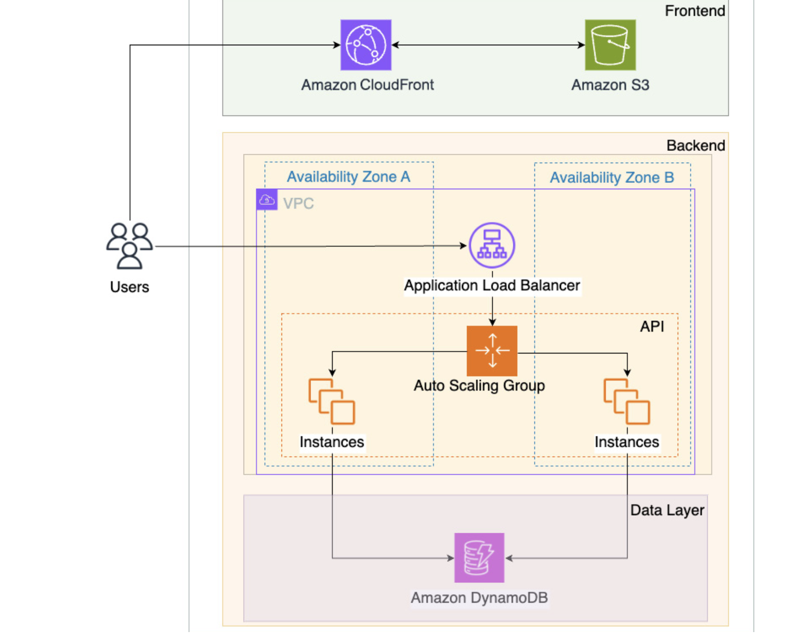
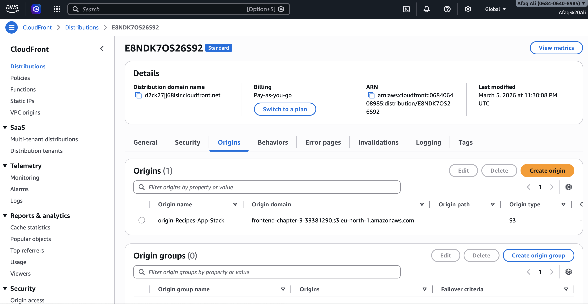
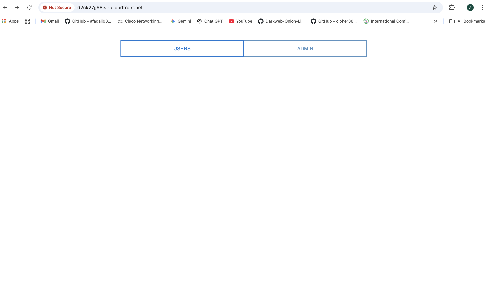
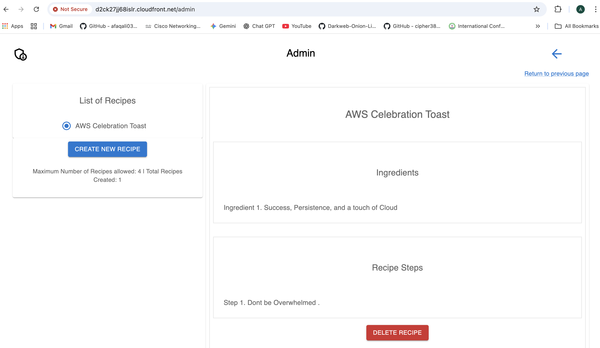

# 🍲 AWS Cloud Recipe Sharing Application

[](https://aws.amazon.com/)
[](https://aws.amazon.com/ec2/)
[](https://aws.amazon.com/dynamodb/)
[](https://aws.amazon.com/cloudfront/)
[](https://aws.amazon.com/s3/)
[](https://reactjs.org/)
[](https://nodejs.org/)
[](https://www.npmjs.com/)
---

# 📖 Executive Summary

This project demonstrates the deployment of a **cloud-native recipe-sharing web application on AWS**.  
The architecture integrates **static website hosting, compute services, and a NoSQL database** to create a scalable and performant web platform.

The application allows users to **view and share cooking recipes**, with frontend assets served globally through **Amazon CloudFront** and backend logic executed on **Amazon EC2** while storing application data in **Amazon DynamoDB**.

---

# 🚀 Key Technical Achievements

| Feature | Description |
|------|-------------|
| **Global Content Delivery** | CloudFront CDN accelerates frontend delivery |
| **Highly Durable Storage** | Static website hosted on Amazon S3 |
| **Scalable Compute Layer** | Application logic deployed on EC2 |
| **NoSQL Backend** | DynamoDB used for fast key-value storage |
| **Cloud Integration** | Frontend, compute, and database services connected |

---

# 🏗 System Architecture



### Architecture Layers

| Layer | Service | Function |
|------|--------|----------|
| **Frontend** | Amazon S3 | Static website hosting |
| **Content Delivery** | Amazon CloudFront | Global CDN acceleration |
| **Application Layer** | Amazon EC2 | Handles recipe requests |
| **Database Layer** | Amazon DynamoDB | Stores recipe data |

---

## 🚀 Deployment Flow Diagram

    React Source Code
            │
            ▼
    npm build
            │
            ▼
    Static Files (build/)
            │
            ▼
    Amazon S3 Bucket (Static Hosting)
            │
            ▼
    Amazon CloudFront CDN
            │
            ▼
    End Users (Browser)
            │
            ▼
    EC2 Backend (Node.js API)
            │
            ▼
    DynamoDB Table

---
## ⚛️ Frontend Application (React)

The frontend of the Recipe Sharing Application was developed using **React.js** and built using **Node.js and npm**.  
After building the production bundle, the static files were deployed to **Amazon S3** for static website hosting and delivered globally through **Amazon CloudFront**.


### 🛠 Frontend Build Process

1. Install project dependencies

inside frontend folder run these commands.
```bash
npm install
```
Build the production version of the React application
```bash
npm run build
```
This command generates an optimized production bundle inside the "dist/"  directory.


### ☁️ Deployment to Amazon S3

The generated build files were uploaded to an Amazon S3 bucket configured for static website hosting.

Example deployment command:

### 🌍 Content Delivery via CloudFront

To improve performance and reduce latency:

Amazon CloudFront was configured in front of the S3 bucket

Static assets are cached at edge locations worldwide

Users receive faster content delivery


---

## 🧠 Technologies Used

**React.js**

**Node.js**

**npm**

**Amazon S3 Static Website Hosting**

**Amazon CloudFront CDN**

---
# 🧭 Request Flow


    User
    │
    ▼
    CloudFront CDN
    │
    ▼
    S3 Static Website
    │
    ▼
    EC2 Application Server
    │
    ▼
    DynamoDB Database

---

# ⚙️ Infrastructure Configuration

## Cloud Resources

| Resource | Purpose |
|--------|---------|
| **Amazon S3** | Static frontend hosting |
| **Amazon CloudFront** | CDN for fast global delivery |
| **Amazon EC2** | Backend application logic |
| **Amazon DynamoDB** | Recipe data storage |

---

# 🗄 DynamoDB Table Schema

| Attribute | Type | Description |
|--------|------|-------------|
| RecipeID | String (PK) | Unique recipe identifier |
| Title | String | Recipe name |
| Ingredients | String | Ingredients list |
| Instructions | String | Cooking steps |
| Author | String | Recipe contributor |

---

# 💻 Example Backend Logic

```javascript
// Example: Fetch recipes from DynamoDB

const AWS = require('aws-sdk');
const dynamodb = new AWS.DynamoDB.DocumentClient();

exports.getRecipes = async () => {
    const params = {
        TableName: "Recipes"
    };

    const data = await dynamodb.scan(params).promise();
    return data.Items;
};
```
## 📈 Final Deployment Proof

### CloudFront Distribution



### Application UI





#
## 🧹 Cost Management & Cleanup

To avoid unnecessary charges and follow **cloud cost-optimization best practices**, all provisioned resources were removed after testing.

| Resource | Action |
|--------|--------|
| **EC2 Instance** | Terminated |
| **CloudFront Distribution** | Disabled |
| **DynamoDB Table** | Deleted |
| **S3 Bucket** | Emptied and removed |


#

## 🔧 Key Skills Demonstrated

React.js frontend development

Node.js backend API development

Static website hosting (S3)

Content delivery with CloudFront

NoSQL database (DynamoDB)

AWS deployment workflow and cost management

#
## 👨‍💻 Author

**Afaq Ali**

Aspiring Cloud Engineer  
Specializing in **AWS Cloud Infrastructure & Networking**

📍 Islamabad, Pakistan
